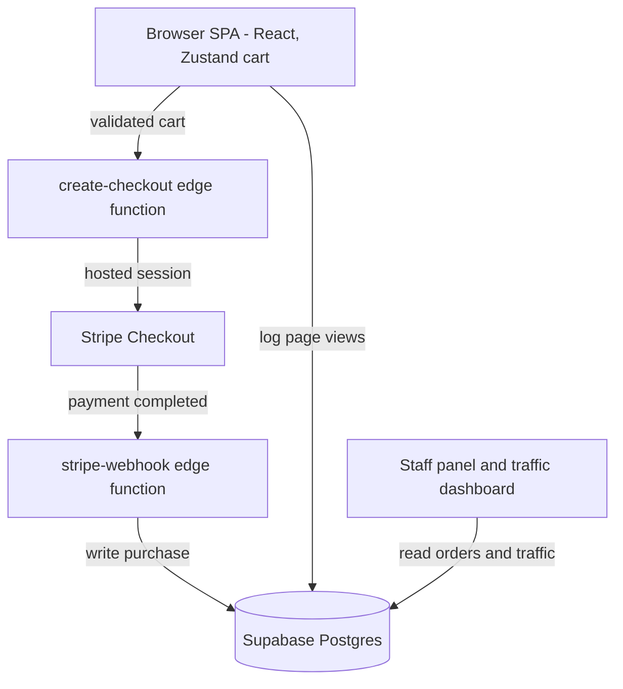

<p align="center">
  
</p>

<h1 align="center">Speedway 146</h1>

<p align="center">
  Website for <a href="https://speedway146.com">speedway146.com</a> — a go-kart racing and family
  entertainment venue in Baytown, TX. Book races, packages, and parties online.
</p>

<p align="center">
  
  
  
  
  
  
  
  
</p>

- **Book & pay online** — browse single-kart ticket bundles, double-seater packages, and party rentals, add them to a cart, and check out through Stripe.
- **Server-authoritative pricing** — a Supabase edge function re-prices every cart against a canonical price map, applies Texas tax and a group discount, and builds the Stripe session, so totals can't be tampered with client-side.
- **Staff operations built in** — an authenticated panel for orders and revenue plus a live traffic dashboard, both reading straight from Supabase behind row-level security.

> The repository is named `baytowngocarts-com` for historical reasons — the live product is **Speedway 146**.

## Stack

| Layer | Choice |
|-------|--------|
| Framework | React 18 + React Router 6 |
| Build | Vite 5 |
| Styling | Tailwind CSS 3 + CSS custom properties (`Theme.css` tokens) |
| Cart state | Zustand (in-memory store) |
| Motion | Framer Motion · AOS · react-intersection-observer |
| Backend | Supabase — Postgres + RLS, Deno edge functions |
| Payments | Stripe Checkout via Stripe Connect |
| Analytics | Supabase traffic log (ipapi.co geo) + embedded Sunday Analyzer beacon |
| Hosting | Vercel (SPA rewrites + security headers in `vercel.json`) |

## Getting started

```bash
npm install
npm run dev        # Vite dev server
npm run build      # production build
npm run lint       # eslint
npm run preview    # preview the production build
```

Two environment variables are required for the Supabase client: `VITE_SUPABASE_URL` and `VITE_SUPABASE_ANON_KEY`.

## Tickets, packages & checkout

Products live in `src/lib/stripe-config.js`, generated from a few small tier tables:

- **Single-kart bundles** — 1 / 4 / 8 / 15 / 25 / 35 / 50 tickets, `$13.99` up to `$399.99`, with the per-race rate dropping as the bundle grows.
- **Double-seater bundles** — 1 / 2 / 4 / 6 tickets, `$19.99` to `$89.99` (driver 53"+, passenger 33"+).
- **Party packages** — the `$699` All-Access Family Race Party plus private-track and add-on upgrades.

The cart is a Zustand store (`useCart`) that any component can read reactively; it survives client-side navigation. Checkout hands the cart to the `create-checkout` edge function, which validates each item against a server-side price map, computes fees, builds the hosted Stripe session, and returns its URL — secret keys and pricing logic never reach the browser.

| Fee component | Rate |
|---------------|------|
| Transaction fee | 4% + $0.30 |
| Platform fee | 1% |
| Texas sales tax | 8.25% |
| Group discount | −10% at 15 or more tickets |

On successful payment, Stripe calls the `stripe-webhook` edge function, which writes the order (number `SPW146-YYYY-NNNNNN`) into the Supabase `purchases` table with the service-role key.

## Staff panel & analytics

`/staff` is an authenticated operations panel — staff status is checked against a `staff` table via `useAdmin`. It surfaces order and revenue tiles (all-time and today), a searchable and date-filterable order list, expandable line-item / customer detail, and inline payment-status updates.

`/traffic` is a staff-only dashboard over the `site_traffic` table: page views by path, device breakdown, referrer sources, hourly activity, and IP-based geolocation, all filterable by time range. Rows are written by the `useTrafficLogger` hook on every customer-facing page mount (staff routes are excluded so internal navigation never pollutes the data). A second, independent layer — the `sunday-analyzer` provider — fires a cookieless pageview beacon to an external analytics endpoint.

## Marketing site

The home page is an animated storefront built with Framer Motion and AOS: a five-image hero slideshow, feature and attraction sections, an eight-image gallery, six customer testimonials, a categorized FAQ, and a pricing overview. The visual system is driven entirely by CSS custom properties in `src/styles/Theme.css`, so palette changes are a single-file edit.

## Data flow



## Project structure

```
src/
  components/   common UI, section blocks, pricing cards, forms
  pages/        routes — Home, Pricing, Cart, Success, StaffPanel, Traffic, …
  hooks/        useCart (Zustand), useAuth, useAdmin, useTraffic
  layouts/      MainLayout — header, footer, page-view logging
  lib/
    stripe-config.js   product tiers, packages, price ids
    supabase.js        shared Supabase client
    content/           hero, gallery, faqs, testimonials, business info
    sunday-analyzer/   cookieless pageview beacon provider
  styles/       Theme.css — design tokens (CSS custom properties)
supabase/
  functions/    create-checkout, stripe-webhook (Deno edge functions)
  site-traffic-schema.sql
public/images/  venue photos, logo, waivers
```

## License

Private project — all rights reserved. Made by [TaylorURL](https://taylorurl.com).
