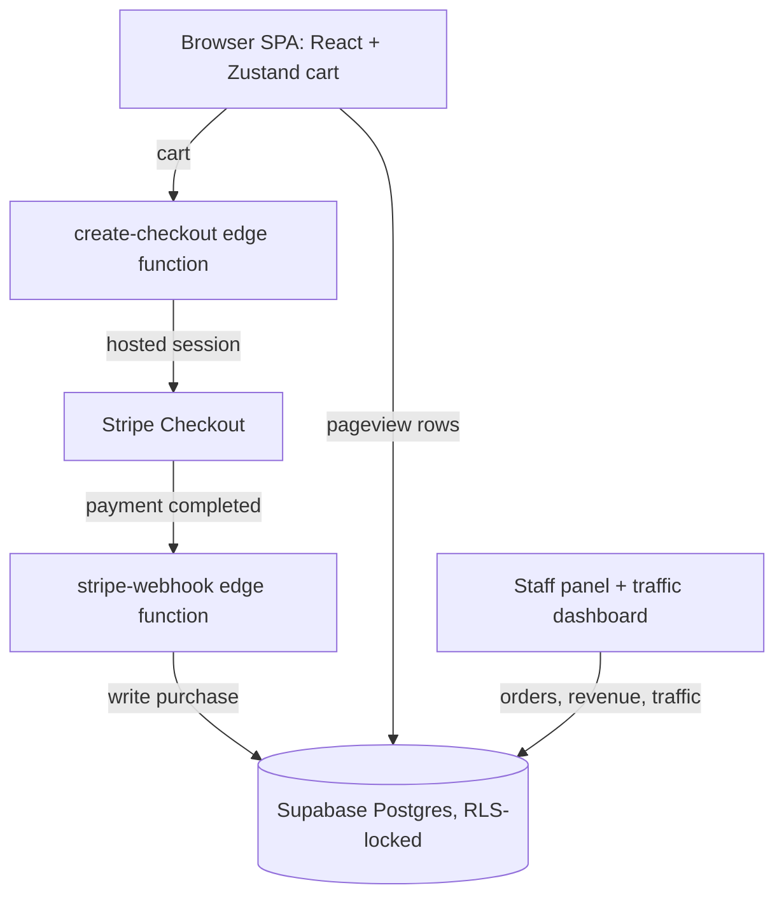

<p align="center">
  
</p>

<h1 align="center">Speedway 146</h1>

<p align="center">
  <b>Go-kart racing and family entertainment in Baytown, TX.</b>
</p>
<p align="center">
  The storefront and back office for Speedway 146 — book races, packages, and parties online.<br />
  Live at <a href="https://speedway146.com">speedway146.com</a>.
</p>

<p align="center">
  
  
  
  
  
  
  
</p>

<br />

## Why Speedway 146

A track's website usually stops at hours and a phone number. This one sells the product: ticket bundles, double-seater packages, and party rentals go into a cart and out through Stripe Checkout, while the same app doubles as the staff back office for orders, revenue, and site traffic. Pricing is never trusted to the browser — every cart is re-priced server-side before a payment session exists.

<table width="100%">
  <tr>
    <td width="50%" valign="top">
      <h3 align="center">Server-authoritative pricing</h3>
      <p align="center">A Supabase edge function re-prices every line against a canonical price map, applies tax, fees, and the group discount, then builds the Stripe session — totals cannot be tampered with client-side.</p>
    </td>
    <td width="50%" valign="top">
      <h3 align="center">Back office included</h3>
      <p align="center">An authenticated staff panel for orders and revenue plus a live traffic dashboard, both reading straight from Postgres behind row-level security.</p>
    </td>
  </tr>
</table>

<br />

> The repository is named `baytowngocarts-com` for historical reasons — the live product is **Speedway 146**.

## Stack

| Layer | Technology |
| :--- | :--- |
| UI | React 18 + React Router 6 |
| Build & dev | Vite 5 |
| Styling | Tailwind CSS 3 over CSS custom properties (`src/styles/Theme.css`) |
| Cart state | Zustand |
| Animation | Framer Motion 11 · AOS · `react-intersection-observer` |
| Backend | Supabase (Postgres + RLS, Deno edge functions) |
| Payments | Stripe Checkout via Stripe Connect |
| Analytics | `site_traffic` table (ipapi.co geo) + cookieless Sunday Analyzer beacon |
| Hosting | Vercel (SPA rewrites + security headers) |

## Getting started

```bash
npm install
npm run dev           # Vite dev server
npm run build         # production build to dist/
```

The Supabase client throws on boot if it is not configured, so two variables are required before the app will run:

| Variable | Purpose |
| :--- | :--- |
| `VITE_SUPABASE_URL` | Supabase project URL. |
| `VITE_SUPABASE_ANON_KEY` | Supabase publishable key for the browser client. |

The edge functions read their own secrets from the Supabase project: `STRIPE_SECRET_KEY`, `STRIPE_CONNECTED_ACCOUNT_ID`, `STRIPE_WEBHOOK_SECRET`, and `SUPABASE_SERVICE_ROLE_KEY`.

### Scripts

| Script | Does |
| :--- | :--- |
| `npm run dev` | Start the Vite dev server. |
| `npm run build` | Production build. |
| `npm run preview` | Serve the production build locally. |
| `npm run lint` | Lint with ESLint. |

## Architecture



## How it works

- **Products are generated, not hand-listed.** `src/lib/stripe-config.js` builds the catalog from small tier tables — single-kart bundles (1/4/8/15/25/35/50 tickets), double-seater bundles, and party packages — deriving ids, price ids, labels, and per-race rates.
- **Checkout is validated server-side.** `create-checkout` compares each client price against the canonical map and rejects mismatches, then applies a 4% + $0.30 transaction fee, a 1% platform fee, 8.25% Texas sales tax, and a 10% group discount at 15 or more tickets.
- **Orders are written by the webhook, not the browser.** `stripe-webhook` verifies the Stripe signature and writes the order — numbered `SPW146-YYYY-NNNNNN` — into the `purchases` table with the service-role key.
- **Two independent analytics layers.** `useTraffic` logs a row per customer-facing page view (staff routes excluded) with user agent, referrer, screen size, and IP geolocation; `sunday-analyzer` fires a separate cookieless beacon via `sendBeacon`.
- **One file owns the palette.** Every Tailwind color maps to a CSS custom property in `Theme.css`, so the asphalt / race-red / caution system is a single-file edit.

## Project structure

```
baytowngokarts-com/
├── public/
│   ├── images/                Venue photos, logo, waiver PDFs
│   ├── robots.txt, sitemap.xml
│   └── release.json
├── supabase/
│   ├── functions/             create-checkout, stripe-webhook (Deno)
│   └── site-traffic-schema.sql
├── src/
│   ├── components/            common UI, marketing sections, pricing cards, forms
│   ├── pages/                 Home, Pricing, Cart, Success, StaffPanel, Traffic, …
│   ├── layouts/               MainLayout — header, footer, pageview logging
│   ├── hooks/                 useCart (Zustand), useAuth, useAdmin, useTraffic
│   ├── lib/
│   │   ├── stripe-config.js   Ticket tiers, packages, price ids
│   │   ├── supabase.js        Shared Supabase client
│   │   ├── content/           Hero, gallery, FAQs, testimonials, business info
│   │   └── sunday-analyzer/   Cookieless pageview beacon
│   └── styles/Theme.css       Design tokens (CSS custom properties)
└── vercel.json                SPA rewrites, security headers, caching
```

## License

Copyright (c) 2026 Trenton Taylor. All rights reserved. See [LICENSE.md](LICENSE.md).

<br />

<p align="center">
  <sub>Built by <a href="https://taylorurl.com">TaylorURL</a> — custom sites for local businesses.</sub>
</p>
